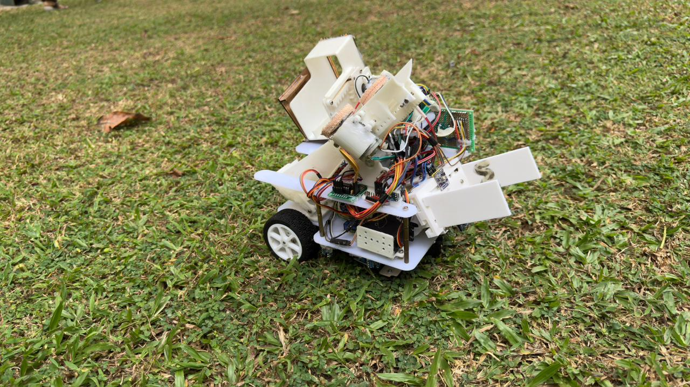
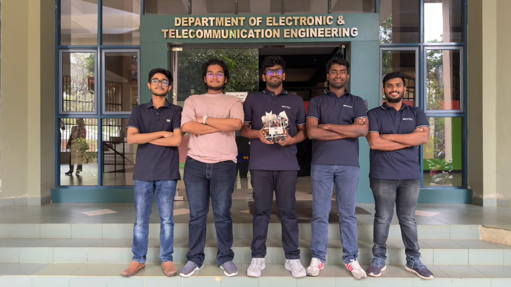

# 🤖 EN2533 Robotic Competition Robot  
### University of Moratuwa  

Autonomous multi-task competition robot developed for **EN2533 – Robotics Design Project**.  
This robot is capable of performing multiple autonomous tasks including line following, grid navigation, ramp climbing, wall following, and projectile shooting.

---

## 📸 Robot & Team

### 🔹 Robot

  

### 🔹 Team

  

> 📌 Replace the above image paths with actual images in your repository.

---

## 🎥 Demonstration Videos

- 🎬 Line Following – [Line Following Demo](Videos/slotted_line.mp4)
- 🎬 Ramp Climbing – [Ramp Climbing Demo](Videos/ramp.mp)
- 🎬 Circular Wall Following – [Circular Wall Demo](Videos/circular_wall.mp)

---

# 🚀 Project Overview

This robot was designed to autonomously complete multiple tasks in a structured competition arena.  
It integrates **PID control, sensor fusion, velocity control, and modular task-based programming** to achieve reliable navigation and precision task execution.

The robot operates using an Arduino-based control system with modular `.ino` files structured according to task functionality.

---

# ✅ Key Functionalities

✔ Straight line following using PID control  
✔ Dotted line detection and tracking  
✔ Grid navigation with intersection detection  
✔ Velocity-controlled ramp climbing  
✔ Circular wall following using IR sensors  
✔ Rotational and translational motion control  
✔ Arrow / Ball shooting mechanism  
✔ Task-based modular execution  

---

# 🧠 Tasks Implemented

## 🔹 Task 1 – Grid Navigation
- Detect intersections
- Navigate structured grid paths
- Perform controlled rotations
- Mapping and directional decision logic

Files:
- `task1_grid.ino`
- `task1_mapping.ino`

---

## 🔹 Task 2 – Dotted Line Following
- Detect broken/dotted lines
- Maintain trajectory despite missing segments
- PID-based correction system

File:
- `task2_dotline_follow.ino`

---

## 🔹 Task 3 – Ramp Climbing
- Velocity control for incline surfaces
- Motor power compensation
- Stable ascent and descent

File:
- `task3_ramp.ino`

---

## 🔹 Task 4 – Circular Wall Following
- IR-based wall distance measurement
- Continuous curvature tracking
- Circular wall navigation

Files:
- `task4_wall_follow.ino`
- `wall_following.ino`
- `circular.ino`

---

## 🔹 Task 6 – Arrow / Ball Shooting
- Target alignment
- Triggered shooting mechanism
- Motor-driven projectile system

File:
- `task6_arrow_shooting.ino`

---

# ⚙️ Control & Navigation System

## 🔹 Line Following System
- Sensor array reading
- Error calculation
- PID control loop

Files:
- `line_follow.ino`
- `line_pid.ino`
- `filters.ino`
- `ir_functions.ino`

---

## 🔹 Motion Control

### Translational Movement
- Forward / backward control
- Smooth acceleration

File:
- `translational.ino`

### Rotational Movement
- Precise turning angles
- Intersection-based rotations

File:
- `rotational.ino`

### Motor Control Interface
- Low-level motor instructions
- Speed and direction management

File:
- `motor_instructions.ino`

---

## 🔹 Main Control Logic

- Task switching
- Mode management
- Execution sequencing

File:
- `main.ino`
- `misc.ino`
- `mid_special.ino`

---

# 🧰 Technical Specifications

| Component | Description |
|------------|-------------|
| Microcontroller | Arduino-based system |
| Drive System | Differential drive |
| Sensors | IR sensor array |
| Control Method | PID Control |
| Navigation | Line-based & Wall-based |
| Shooting Mechanism | Motor-driven launcher |
| Programming Language | Arduino C/C++ |
| Architecture | Modular multi-file system |

---

# 📂 Repository Structure
.
├── main.ino
├── line_follow.ino
├── line_pid.ino
├── wall_following.ino
├── circular.ino
├── translational.ino
├── rotational.ino
├── motor_instructions.ino
├── task1_grid.ino
├── task1_mapping.ino
├── task2_dotline_follow.ino
├── task3_ramp.ino
├── task4_wall_follow.ino
├── task6_arrow_shooting.ino
└── misc.ino

---

---

# 🏁 Competition Capabilities Summary

| Capability | Status |
|------------|--------|
| Straight Line Following | ✅ |
| Dotted Line Tracking | ✅ |
| Grid Navigation | ✅ |
| Ramp Climbing with Velocity Control | ✅ |
| Circular Wall Following | ✅ |
| Projectile Shooting | ✅ |

---

# 🔬 Control Techniques Used

- PID control for line correction  
- Velocity compensation for ramp climbing  
- Sensor filtering techniques  
- Modular state-based programming  
- Differential drive kinematics  

---

# 👨‍💻 Team

Developed by EN2533 Robotics Project Team  
University of Moratuwa  

---

# ⭐ Acknowledgment

This project was developed as part of the EN2533 Robotics Design Project at the University of Moratuwa.

---

